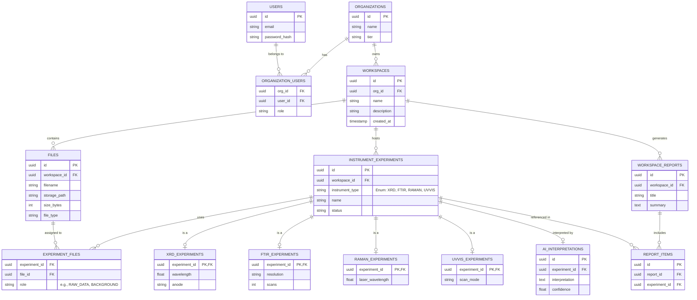

# MatPilot V2 Entity Relationship Diagram (ERD)

```mermaid
erDiagram
    ORGANIZATIONS {
        uuid id PK
        string name
        string tier
    }
    USERS {
        uuid id PK
        string email
        string password_hash
    }
    ORGANIZATION_USERS {
        uuid org_id FK
        uuid user_id FK
        string role
    }
    WORKSPACES {
        uuid id PK
        uuid org_id FK
        string name
        string description
        timestamp created_at
    }
    FILES {
        uuid id PK
        uuid workspace_id FK
        string filename
        string storage_path
        int size_bytes
        string file_type
    }
    INSTRUMENT_EXPERIMENTS {
        uuid id PK
        uuid workspace_id FK
        string instrument_type "Enum: XRD, FTIR, RAMAN, UVVIS"
        string name
        string status
    }
    EXPERIMENT_FILES {
        uuid experiment_id FK
        uuid file_id FK
        string role "e.g., RAW_DATA, BACKGROUND"
    }
    XRD_EXPERIMENTS {
        uuid experiment_id PK, FK
        float wavelength
        string anode
    }
    FTIR_EXPERIMENTS {
        uuid experiment_id PK, FK
        string resolution
        int scans
    }
    RAMAN_EXPERIMENTS {
        uuid experiment_id PK, FK
        float laser_wavelength
    }
    UVVIS_EXPERIMENTS {
        uuid experiment_id PK, FK
        string scan_mode
    }
    AI_INTERPRETATIONS {
        uuid id PK
        uuid experiment_id FK
        text interpretation
        float confidence
    }
    WORKSPACE_REPORTS {
        uuid id PK
        uuid workspace_id FK
        string title
        text summary
    }
    REPORT_ITEMS {
        uuid id PK
        uuid report_id FK
        uuid experiment_id FK
    }

    ORGANIZATIONS ||--o{ ORGANIZATION_USERS : "has"
    USERS ||--o{ ORGANIZATION_USERS : "belongs to"
    ORGANIZATIONS ||--o{ WORKSPACES : "owns"
    WORKSPACES ||--o{ FILES : "contains"
    WORKSPACES ||--o{ INSTRUMENT_EXPERIMENTS : "hosts"
    INSTRUMENT_EXPERIMENTS ||--o{ EXPERIMENT_FILES : "uses"
    FILES ||--o{ EXPERIMENT_FILES : "assigned to"
    
    INSTRUMENT_EXPERIMENTS ||--o| XRD_EXPERIMENTS : "is a"
    INSTRUMENT_EXPERIMENTS ||--o| FTIR_EXPERIMENTS : "is a"
    INSTRUMENT_EXPERIMENTS ||--o| RAMAN_EXPERIMENTS : "is a"
    INSTRUMENT_EXPERIMENTS ||--o| UVVIS_EXPERIMENTS : "is a"

    INSTRUMENT_EXPERIMENTS ||--o| AI_INTERPRETATIONS : "interpreted by"
    
    WORKSPACES ||--o{ WORKSPACE_REPORTS : "generates"
    WORKSPACE_REPORTS ||--o{ REPORT_ITEMS : "includes"
    INSTRUMENT_EXPERIMENTS ||--o{ REPORT_ITEMS : "referenced in"
```
